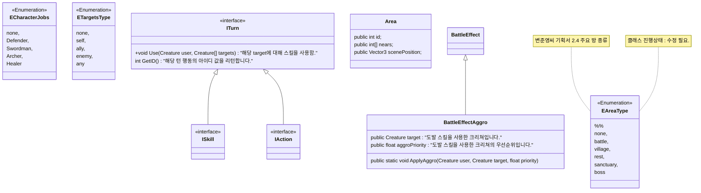

# 클래스 UML을 쓰는 이유

- 텍스트를 기반으로 UML을 작성해도 못 알아듣겠음
- 
# 범례

| 기호      | 이름                   | 설명                                                                                                 |
| ------- | -------------------- | -------------------------------------------------------------------------------------------------- |
| `<\|--` | **상속 (Inheritance)** | 한 클래스가 다른 클래스를 **상속**할 때 사용합니다. (부모 → 자식 관계)                                                       |
| `*--`   | **합성 (Composition)** | **강한 소유 관계**입니다. 전체가 없어지면 부분도 함께 없어집니다. (예: "집"과 "방")                                              |
| `o--`   | **집합 (Aggregation)** | **느슨한 소유 관계**입니다. 전체가 없어져도 부분은 존재할 수 있습니다. (예: "학교"와 "학생") A 객체가 생성되기 전에 B 객체가 이미 만들어져 있을 수도 있습니다. |
| `-->`   | **연관 (Association)** | 단순한 **관계**입니다. 두 클래스 간에 연결이 있음을 나타냅니다. (예: "고객"과 "주문")                                             |
| `--`    | **링크 (Solid Link)**  | 단순 연결선으로, 특별한 의미 없이 객체 간 연결을 나타냅니다.                                                                |
| `..>`   | **의존 (Dependency)**  | 한 클래스가 다른 클래스를 **잠시 참조**하거나 **사용**할 때 나타냅니다. (예: 메소드 파라미터로 사용)                                     |
| `..\|>` | **실현 (Realization)** | 인터페이스를 **구현(Implement)** 할 때 사용합니다. (클래스 → 인터페이스)                                                  |
| `..`    | **링크 (Dashed Link)** | 점선 연결선으로, 약한 연결이나 추상적 관계를 나타낼 때 사용합니다.                                                             |

마크 다운 표라서 어쩔수 없는데, 상속이나 링크를 표현할 때에는 `<|--`와 `<|..`로 표현합니다.
## 상속시 알아야 하는거
UML에서 클래스 A가 있고 퍼블릭 가상 함수 F와 G가 있어요. 그리고 클래스 B는 클래스 A를 상속하고 가상함수 F를 오버라이드하는데, UML에서는 클래스 B에서 F와 G를 표기합니까?

UML 다이어그램은 중복을 줄이고 핵심만 보여주려는 목적이 있어요.
B가 A를 상속한다는 것 자체가 A의 모든 퍼블릭/프로텍티드 멤버를 물려받는다는 의미이기 때문에,
B 클래스 안에는 특별히 "새로 정의한 것(오버라이드한 것)"만 명시합니다.

# A. UML

## A.1. 전반적인 클래스 관계

1

## A.2. 스킬

ㅁㄴㅇㅁㄴ

